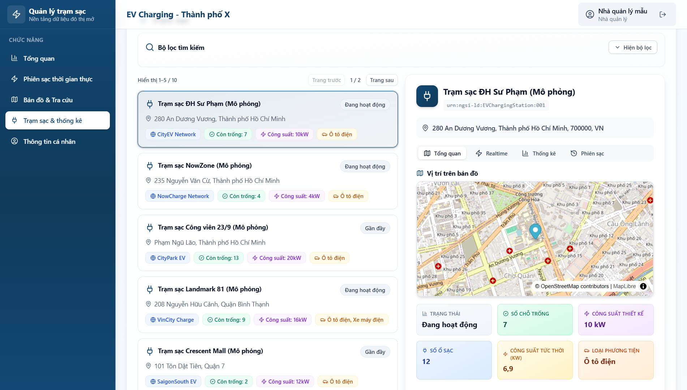
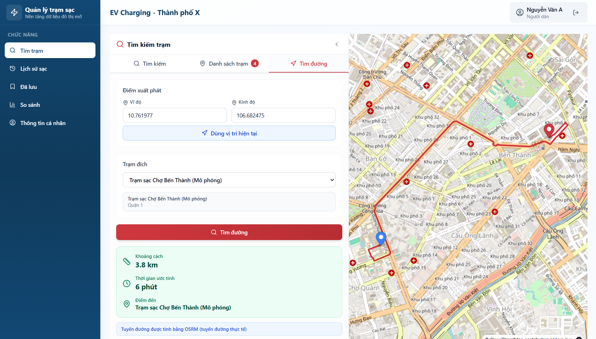

# EV Charging App

Ứng dụng EV Charging App cung cấp cổng dữ liệu mở và bảng điều khiển dành cho **nhà quản lý** và **người dân** nhằm theo dõi, phân tích hoạt động các trạm sạc xe điện trong đô thị. Dự án được phát triển theo yêu cầu OLP 2025 Smart City với trọng tâm **Linked Open Data** (SOSA/SSN, NGSI-LD, FiWARE Smart Data Models).

## 1. Kiến trúc tổng quan

```
├─ backend/  (FastAPI + MongoDB + ETL JSON-LD)
│   ├─ REST API (stations, analytics, citizens, datasets)
│   ├─ NGSI-LD endpoints & WebSocket realtime
│   └─ ETL dữ liệu mở từ ev-charging-open-data
├─ frontend/ (React 19 + TypeScript + Vite + Tailwind)
│   ├─ Dashboard cho nhà quản lý (overview, realtime, bản đồ, thống kê)
│   └─ Trải nghiệm người dân (tìm trạm, lịch sử, trạm đã lưu, so sánh)
├─ ev-charging-open-data/ (submodule dữ liệu JSON-LD – CC BY 4.0)
└─ README.md, DEPENDENCIES.md, LICENSE
```

**Công nghệ chính**

- Backend: FastAPI, MongoDB, Pydantic, HTTPX, WebSocket, JWT auth
- Frontend: React 19, TypeScript, Tailwind CSS, MapLibre GL JS, React-Leaflet
- Dữ liệu mở: JSON-LD (SOSA/SSN), NGSI-LD, tương thích FiWARE Smart Data Models
- Phân phối: Giấy phép mã nguồn MIT, dữ liệu mở CC BY 4.0, phát hành qua GitHub

Chi tiết mỗi phần xem thêm tại:

- [`backend/README.md`](backend/README.md)
- [`frontend/README.md`](frontend/README.md)
- [`DEPENDENCIES.md`](DEPENDENCIES.md)

## 2. Giao diện ứng dụng

### 2.1. Dashboard cho nhà quản lý



Giao diện quản lý hệ thống trạm sạc với tổng quan và phân tích dữ liệu.

### 2.2. Giao diện người dân



Tìm kiếm, lọc và sử dụng các trạm sạc xe điện.

## 3. Dữ liệu và giấy phép

| Tài nguyên                         | Giấy phép | Ghi chú |
|-----------------------------------|-----------|--------|
| Mã nguồn (backend, frontend)      | MIT       | Xem file [`LICENSE`](LICENSE) |
| Dữ liệu JSON-LD (stations, sessions, sensors, citizens) | CC BY 4.0 | Từ repo [`tynnp/ev-charging-open-data`](https://github.com/tynnp/ev-charging-open-data) |

Ứng dụng hỗ trợ tải về bộ dữ liệu JSON-LD qua các endpoint `/datasets/*.jsonld`, đảm bảo tuân thủ yêu cầu FAIR/5-star open data.

## 4. Chuẩn bị môi trường

### 4.1. Yêu cầu chung

- **Python 3.11+** và `pip`
- **Node.js 20+** và `npm`
- **MongoDB** đang chạy tại `mongodb://localhost:27017` (có thể cấu hình lại)
- Git để clone và quản lý submodule dữ liệu

### 4.2. Thiết lập backend

```bash
cd backend
python -m venv .venv
source .venv/bin/activate  # Windows: .venv\Scripts\activate
pip install -r requirements.txt

# Cấu hình SMTP để gửi OTP email (bắt buộc)
cp env.example .env
# Mở .env và cập nhật SMTP_HOST, SMTP_PORT, SMTP_USERNAME, SMTP_PASSWORD, EMAIL_FROM
# Cấu hình biến môi trường (tùy chỉnh SECRET_KEY, OSRM_URL nếu cần)

# Chạy ETL dữ liệu JSON-LD
python -m app.etl

# Khởi động API
uvicorn app.main:app --reload
```

Backend cung cấp REST, NGSI-LD, WebSocket realtime và bộ test cơ bản (`pytest` hoặc `python -m unittest`). Xem thêm trong [`backend/README.md`](backend/README.md).

> **Lưu ý:** chức năng đăng ký người dùng yêu cầu gửi OTP qua email. Bạn phải cung cấp thông tin SMTP hợp lệ trong file `.env` (xem `backend/env.example`) trước khi chạy server.

### 3.3. Thiết lập frontend

```bash
cd frontend
npm install
cp env.example .env   # tùy chỉnh VITE_API_BASE_URL nếu backend không chạy tại localhost:8000
npm run dev           # mặc định http://localhost:5173
```

Frontend hỗ trợ phân quyền theo role, realtime qua WebSocket và tích hợp bản đồ. Chi tiết cấu trúc và tính năng tại [`frontend/README.md`](frontend/README.md).

### 3.4. Triển khai bằng Docker

Dự án đã được Docker hóa sẵn, hỗ trợ chạy trên cả Windows và Unix/Linux. Bạn có thể sử dụng các file script có sẵn để khởi động nhanh ứng dụng:

#### Windows
```bash
start-docker-windows.bat
```

#### Unix/Linux/MacOS
```bash
chmod +x start-docker-unix.sh
./start-docker-unix.sh
```

### Hoặc chạy trực tiếp bằng docker-compose:

Yêu cầu: Docker Desktop (Windows/macOS) hoặc Engine (Linux) phiên bản hỗ trợ Compose v2.

1. **Khởi động toàn bộ stack** (MongoDB + backend FastAPI + frontend Nginx):

   > **Chuẩn bị trước:** sao chép `backend/env.example` thành `backend/.env` và cập nhật cấu hình SMTP (SMTP_HOST, SMTP_PORT, v.v.) cùng các biến bí mật khác. File `.env` này sẽ được `docker-compose` nạp vào container backend để gửi email OTP.

   ```bash
   docker compose up -d --build
   ```

   - Frontend: http://localhost:5173
   - Backend API/Swagger: http://localhost:8000 (`/docs`, `/redoc`)
   - MongoDB: localhost:27017 (volume `mongo_data`)

2. **Theo dõi log** một service cụ thể (ví dụ backend):

   ```bash
   docker compose logs -f backend
   ```

3. **Dừng và gỡ stack** (giữ lại dữ liệu MongoDB trong volume):

   ```bash
   docker compose down
   ```

#### Tuỳ chỉnh khi build/chạy

- **Backend** (`docker-compose.yml`):
  - `SECRET_KEY`: thay giá trị mạnh cho môi trường thật.
  - `RUN_ETL=false`: bỏ qua bước nạp dữ liệu mẫu khi container khởi động.
  - `EV_OPEN_DATA_DIR`: trỏ tới thư mục dữ liệu khác nếu cần.
- **Frontend**: thay `build.args.VITE_API_BASE_URL` để trỏ tới API ở domain/port khác; có thể đặt env tại runtime bằng cách rebuild image.
- **MongoDB**: đổi map port hoặc volume nếu dùng instance bên ngoài.

#### Build/chạy từng thành phần riêng (tuỳ chọn)

- Backend:

  ```bash
  docker build -f backend/Dockerfile -t ev-charging-backend .
  docker run --rm -p 8000:8000 \
    -e MONGODB_URI=mongodb://host.docker.internal:27017 \
    ev-charging-backend
  ```

- Frontend:

  ```bash
  docker build -f frontend/Dockerfile -t ev-charging-frontend \
    --build-arg VITE_API_BASE_URL=http://localhost:8000 .
  docker run --rm -p 5173:80 ev-charging-frontend
  ```

Các file cấu hình Docker nằm trong `backend/`, `frontend/` và `docker-compose.yml`.

## 4. Tài khoản mẫu & truy cập

| Vai trò        | Tên đăng nhập | Mật khẩu     |
|----------------|---------------|--------------|
| Nhà quản lý    | `manager`     | `manager123` |
| Người dân      | `citizen`     | `citizen123` |

Các tài khoản được tạo tự động khi backend khởi động lần đầu (`create_default_users`).

## 5. Kiểm thử & chất lượng

- Backend: `python -m unittest` (xem `backend/tests/test_app_basic.py`)
- Frontend: sử dụng ESLint (`npm run lint`) và Vite build để kiểm tra type (`npm run build`)
- Có thể bổ sung Vitest/React Testing Library cho frontend trong tương lai

## 6. Quy trình phát hành

1. **Mã nguồn công khai**: GitHub `tynnp/ev-charging-app`
2. **Giấy phép OSI**: MIT (mã nguồn) + CC BY 4.0 (dữ liệu)
3. **Build instructions**: mô tả ở README backend/frontend và mục 3 ở đây

## 7. Đóng góp & phát triển tiếp

- Tuân thủ style code (PEP8 cho Python, ESLint + Prettier conventions cho frontend)
- Tạo tính năng mới cần cập nhật tài liệu (README, DEPENDENCIES)
- Đảm bảo dữ liệu mới tuân thủ giấy phép mở và chuẩn NGSI-LD/SOSA

---

**Liên hệ**: Hồ sơ dự án & tài liệu bổ sung được cập nhật tại kho GitHub chính thức. Mọi câu hỏi liên hệ qua trang thông tin đội thi hoặc issues trên repo.
